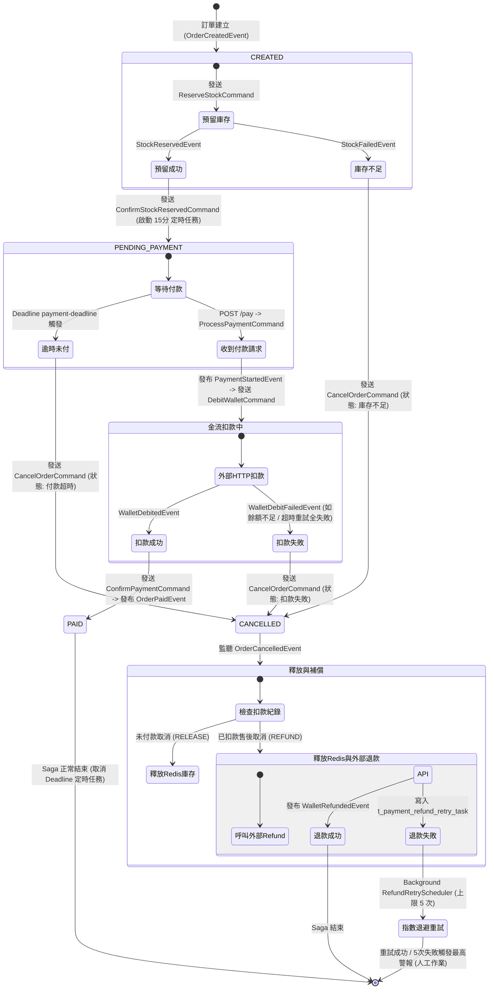

# High-Concurrency Event-Driven CQRS Order System Demo

本專案是一個基於 Spring Boot 3.x/4.x 與 Java 17/20 構建的高性能、具備超高併發潛力的事件驅動型 CQRS（命令查詢職責分離）與 Axon Saga 訂單系統核心展示。

專案專注於解決分散式微服務架構中的讀寫吞吐量不對稱、大流量下資料庫連線池保護、以及非同步最終一致性空窗期等實務痛點。專案程式碼分為傳統 Kafka/Redis 自研 CQRS 模式（Legacy 模組）與基於 Axon Framework + Saga 協調器 + MySQL 持久化的事件溯源模式（Axon 模組）。本專案已完全停用外部 Axon Server，改由本地關係型資料庫進行事件儲存與交易協調。

---

## 架構核心亮點與設計細節

### 1. 傳統自研 CQRS 模式 (Legacy Module)
* **Command 端 (寫入端)**：專注狀態變更。接收寫入請求並進行嚴格的防禦性參數校驗，將訂單持久化至 MySQL，隨即非同步發送 Kafka 事件，保障低延遲寫入。
* **Query 端 (讀取端)**：高性能唯讀架構。透過背景 Consumer 監聽 Kafka 事件，即時更新讀取端專用的快取資料庫（Redis 唯讀視圖），面對海量 GET 請求做到不查主要資料庫、毫秒級回傳。
* **交易事務外置模式**：將實體資料庫寫入侷限在細粒度的隔離方法中，避免用全域事務包裹外部 Kafka/Redis 網路 I/O。利用 Spring 原生 Lazy 註解優雅破解循環依賴，確保「MySQL 交易提交、連線釋放歸還後，才發動非同步網路 I/O」。
* **等冪性與順序性**：
  * 生產端配置 `acks=all`、`retries=3`、`max.in.flight.requests.per.connection=5`，開啟 Kafka 內建等冪性發送。
  * 消費端引入 Redis 分散式鎖進行業務去重，防止重複消費。
  * 發送事件時以 `orderId` 作為 Kafka Key，確保同一筆訂單的事件進入同一個 Partition，保證消費順序性。
* **可靠發件箱模式 (Outbox Pattern)**：
  * **雙寫一致性保障**：為了解決傳統模式下「MySQL 寫入成功、但 Kafka 發送失敗」導致讀寫資料不一致的痛點，將訂單實體與 `t_outbox` 事件紀錄封裝在同一個 MySQL 本地交易中。
  * **交易提交 Hook 與背景自癒**：交易 Commit 後，透過 `afterCommit` Hook 立刻非同步發送 Kafka 事件，實現極低延遲；若即時發送失敗或系統當機，每 5 秒執行的 `OutboxScheduler`（受 Redisson 分散式鎖保護）會掃描未處理的發件箱紀錄並重新投遞，保證 **At-Least-Once Delivery**。
  * **為什麼不在 Axon 模組中實作 Outbox？**：因為 Axon 模組底層採用 **Event Sourcing (事件溯源)** 機制，其產生的領域事件在寫入 `domain_event_entry` 表（本質上就是框架內建的發件箱）時與聚合狀態變更天然處於同一個 MySQL 事務中，已原生解決了雙寫一致性問題；而 Legacy 模組存在傳統手動雙寫（SQL + Kafka）風險，因此最適合手動導入 Outbox Pattern 解決方案。

### 2. Axon Saga 事件溯源與高併發設計 (Axon Module)
本模組實作了基於領域驅動設計 (DDD) 的事件溯源、Saga 分散式事務協調與高併發寫入優化：
* **去 Axon Server 架構**：停用 Axon Server（`axon.axonserver.enabled: false`），改由本地 MySQL 與 Redis 處理狀態。
* **Redis Lua 腳本庫存扣減 (Cluster 相容)**：
  * 收到 `ReserveStockCommand` 時，改用 Redis Lua 腳本進行原子化的庫存預留與扣減，將所有讀寫判定與狀態更新限縮在 Redis 單執行緒內部，避免 Java 端在臨界區進行網路 RTT 往返及 tryLock 阻塞等待，提升併發吞吐量並預防執行緒池飢餓。
  * 採用叢集相容的 **Hash Tag 鍵設計 (`{product:productId}:*`)**，確保同一個商品的所有相關 Redis 鍵（如可用庫存 `{product:productId}:stock`、已預留庫存 `{product:productId}:reserved`、冷熱標記 `{product:productId}:isHot`、更新時間、DCL 互斥鎖等）被雜湊至同一個 Redis 節點 Slot，徹底避免在 Redis 叢集模式下執行 Lua 腳本時拋出 `CROSSSLOT` 錯誤。
* **Kafka 最終一致性同步與寫入優化**：
  * Redis 扣減或釋放成功後，發送 `InventorySyncEvent` 訊息至 Kafka `inventory-sync-events` 主題，以 **`productId`** 作為 Partition Key，保證同一商品的所有更新序列化在同一個分割區，避免跨執行緒資料庫寫入競爭。
  * **背景 Consumer 與策略模式解耦 (OCP)**：背景 Consumer 異步落庫寫回 MySQL，並實作 **JPA 樂觀鎖 (`@Version`)** 防護與 **衝突自動重試機制**，確保最終一致性的絕對安全。為了落實開放封閉原則 (OCP)，本專案已導入**策略模式 (Strategy Pattern)**，將庫存預留、確認扣減、釋放、退款等具體同步業務完全拆分、封裝至獨立的 `InventorySyncHandler` 策略實作中，消除冗長的 `switch-case` 分流，擴充新同步動作時不需修改消費端主類別。
* **訂單快取 TTL、防雪崩抖動與快取失效 (Cache Eviction & Avalanche Protection) 機制**：
  * **過期限制與防雪崩抖動**：訂單寫入 Redis 時，為防範**快取雪崩**（大量 Key 同時過期），在 1 天（24 小時）的基礎上隨機疊加 **0~60 分鐘的抖動時間 (Jitter)**，離散過期時間，並避免歷史垃圾數據無限期吞噬快取伺服器記憶體。
  * **失效快取**：當訂單狀態變更時，改用 Cache Eviction 直接刪除 Redis 快取 Key，完美規避因網路延遲等並發時序錯亂造成的舊資料覆蓋新資料（快取髒數據）問題。
  * **快取延遲載入與 SOLID 解耦**：查詢端與商品查詢端實現 **Cache-Aside 模式**。為了落實單一職責原則 (SRP) 與依賴反轉原則 (DIP)，已將原先控制器的 DCL 快取防禦鎖、MySQL 降級查詢、Jackson 序列化與 Metrics 計數等底層細節完全抽離，封裝於獨立的 `OrderQueryService` 與 `ProductQueryService` 中，Controller 僅做服務委派，徹底免除與 Redis、Redisson 及資料庫 Repository 的直接強耦合。
* **防範快取擊穿、穿透與動態快取載入 (Double-Checked Locking & Penetration Protection)**：
  * **防快取擊穿**：在訂單與商品查詢端實作 Double-Checked Locking 機制，當 Redis 快取未命中時，使用 Redisson 分散式鎖進行併發防護，確保只有一個執行緒去 MySQL 查詢並回寫 Redis，避免海量請求同時穿透資料庫。
  * **防快取穿透 (空值快取)**：查詢不存在的訂單 ID 時，快取端會將值為 `"NULL"` 的防穿透標記寫入 Redis，並設定短效的 **5 分鐘 TTL**。後續請求若命中該標記則直接回傳訂單不存在，不再穿透查詢資料庫，徹底瓦解惡意查詢攻擊。
  * **冷商品動態載入**：在庫存預留端 (Command Side)，若 Redis 快取未命中（模擬冷商品），自動在商品鎖的保護下進行 DCL 載入，將 MySQL 的最新庫存與預留數據同步至 Redis，保證冷商品也能順利下單，為商品的冷熱分離提供底層支持。
* **Saga 分散式持久化超時與自癒機制 (Saga Timeout & Lifecycle Management)**：
  * **超時自癒**：在 `OrderSaga` 中引入 `DeadlineManager`。在新訂單建立時，自動向資料庫註冊一個 15 分鐘的 `payment-deadline` 超時任務。若 15 分鐘內未收到付款確認事件，將自動觸發超時補償機制，釋放預留庫存並取消訂單。
  * **分散式持久化**：重構為基於 MySQL `QRTZ_*` 表格的 **`QuartzDeadlineManager`**。即使服務在此期間斷電、重啟或有多個執行個體部署，超時任務也不會遺失，且能在重啟時精確補償，確保資料的一致性與系統的自癒力。
* **Kafka 消費端異常重試與死信佇列持久化與一鍵重試自癒 (DLQ Reprocessing & Management API)**：
  * **通用異常處理器**：配置 Spring Kafka `CommonErrorHandler`，結合自訂 `DeadLetterPublishingRecoverer` 目的地解析器。針對資料庫連線、樂觀鎖衝突等暫時性異常，自動進行 3 次重試（間隔 1 秒）。重試失敗後，將訊息投遞到 `inventory-sync-events.DLQ` 分割區 0，解決分割區數量不對等的 Destination resolver 警告。
  * **快速失敗與死信**：將 JSON 反序列化解析錯誤 (JsonProcessingException) 設定為不可重試異常，略過重試直接送入死信佇列。
  * **死信落庫與警報**：設有 DLQ 監聽器，一旦訊息降級進入死信，除了模擬發送簡訊警報，亦會將死信內容持久化寫入 `t_axon_dlq_message` 資料表中，初始狀態為 `PENDING`。
  * **一鍵重試自癒 API**：提供 `POST /axonsaga/api/dlq/reprocess` 端點。為符合 SOLID 原則，已將死信資料表查詢、Kafka 重新投遞與資料庫狀態保存邏輯完全從 Controller 抽離，封裝至獨立的 `DlqReprocessService` 服務中。當管理員觸發此 API 時，會從資料庫撈取所有 `PENDING` 死信，解析 JSON 以 `productId` 作為 Partition Key，重新投遞回主要主題 `inventory-sync-events`，保證同商品事件的順序性。重處理成功後，將死信狀態變更為 `REPROCESSED`。
* **模擬外部金流防腐層 (PaymentAdapter/ACL) 與超時/失敗自癒重試機制**：
  * **金流解耦與依賴反轉 (DIP)**：移除本地資料庫強耦合，解耦為獨立外部金流 API (`MockExternalPaymentController`)。為了落實依賴反轉原則 (DIP)，已將原先 `PaymentAdapter` 中手動 `new RestTemplate()` 的硬編碼行為，重構為向 Spring IoC 容器註冊 `RestTemplate` 的 Bean（配有 3 秒連線與讀取超時防護），並以建構子方式注入至 `PaymentAdapter`。
  * **連線超時與扣款重試**：`PaymentAdapter` 透過具備 3 秒 Timeout 防護的 RestTemplate 請求外部扣款，若因網路抖動或超時發生 `RestClientException`，透過 **Spring Retry** 自動進行最多 3 次的指數退避重試 (1s -> 2s -> 4s)。若重試全部失敗，則觸發降級方法發布扣款失敗事件，引導 Saga 執行自動庫存釋放與訂單取消。
  * **假性失敗自癒**：Saga 協調取消訂單時，防腐層會再次比對外部實際扣款交易流水（等冪性），若發現先前超時的扣款請求其實已在外部成功執行（假性失敗），將自動發起退款補償，保障資金流一致性。
  * **退款補償重試佇列**：當外部退款因服務故障回傳 500 錯誤或發生連線異常時，自動將退款任務持久化寫入 MySQL **`t_payment_refund_retry_task`** 表中（初始為 `PENDING`），交由定時排程器 `RefundRetryScheduler` 進行自癒重試。
  * **背景退避重試與最高警報**：排程器每 10 秒執行一次，對待處理任務發起重試並採用指數退避算法 (30s * 2^retryCount) 計算下一次重試時間。若重試 5 次上限仍失敗，則將狀態設為 `FAILED` 並發布最高優先級警報日誌，供工程師手動介入。
  * **動態網址建構與解耦 (OCP)**：在訂單寫入端控制器 `AxonSageOrderCommandController` 中，付款確認後所回傳之 `queryUrl` 與 `Location` 標頭改採 Spring 原生 `ServletUriComponentsBuilder` 從當前 HTTP 請求上下文中動態推導 Host、Port 與 Scheme，徹底清除了原先對宿主機網址（如 `http://localhost:8081`）的硬編碼，實現運行環境的完全解耦與開閉原則之落實。
* **Axon 事件快照機制 (Event Store Snapshotting)**：
  * **快照觸發**：配置 `SnapshotTriggerDefinition` 並關聯訂單聚合根 `AxonSagaOrderAggregate`，將快照事件數閾值設定為 2。當該聚合實體累積產生的歷史事件達到 2 筆時（例如完成「訂單建立」與「庫存預留」），系統會自動非同步觸發快照生成。
  * **快照持久化與還原**：產生的快照將序列化並儲存至資料庫的 `snapshot_event_entry` 表。後續加載聚合時，Axon 會直接讀取最新快照還原聚合狀態，並僅復原/重放快照之後產生的增量事件，大幅度降低隨歷史事件流增長而帶來的聚合重建延遲與資料庫讀取開銷。
* **防範快取擊穿與動態快取載入 (Double-Checked Locking / DCL)**：
  * **防快取擊穿**：在訂單與商品查詢端實作 Double-Checked Locking 機制，當 Redis 快取未命中時，使用 Redisson 分散式鎖進行併發防護，確保只有一個執行緒去 MySQL 查詢並回寫 Redis，避免海量請求同時穿透資料庫。
  * **冷商品動態載入**：在庫存預留端 (Command Side)，若 Redis 快取未命中（模擬冷商品），自動在商品鎖的保護下進行 DCL 載入，將 MySQL 的最新庫存與預留數據同步至 Redis，保證冷商品也能順利下單，為商品的冷熱分離提供底層支持。
* **商品冷熱分離快取策略 (Hot/Cold Cache Separation)**：
  * **分類預熱**：MySQL `t_axon_inventory` 表新增 `is_hot` 標記。啟動時僅預熱 `is_hot = true` 的熱商品（如 `PROD-001`）到 Redis，配置 **1 天 TTL**；冷商品預設不在 Redis 中。
  * **動態短效快取**：當冷商品被查詢或下單觸發 DCL 載入時，在 Redis 中設定短效 **60 秒 TTL**，無人訪問時自動過期，大幅釋放 Redis 記憶體壓力。
  * **更新時 TTL 保護**：在庫存異動時（如預留、扣款、釋放），動態讀取 isHot 標記，更新 stock 與 reserved 時同步刷新對應的 TTL，防止覆蓋操作使冷商品快取永久化。
* **庫存與預留對帳自癒機制 (Inventory & Reservation Reconciliation)**：
  * **定時對帳與自癒**：實作了 `InventoryReconciliationJob`，預設每小時執行一次，比對 MySQL 與 Redis 中的可用庫存、預留庫存及訂單預留明細狀態。若發現兩者漂移不一致，會自動以 MySQL 作為唯一真實數據源 (Source of Truth)，執行自我修正與自癒並回寫 Redis。
  * **手動對帳 API**：提供 `POST /axonsaga/api/inventory/reconcile` 端點，允許系統管理或運維人員手動一鍵觸發數據稽核與校正。
  * **安全交易滑動窗口保護**：若商品或訂單在 5 分鐘內有交易異動，對帳排程將主動跳過該商品，以防覆寫 Kafka 異步同步中的數據。

#### Axon Saga 分散式交易流程狀態圖 (Saga State Machine)



---

## 資料庫實體與表格設計

Axon 模組使用以下 MySQL 表格進行狀態儲存：

1. **t_axon_order (訂單實體表)**
   * `order_id` (VARCHAR, 主鍵)
   * `product_id` (VARCHAR)
   * `quantity` (INT)
   * `price` (BIGINT)
   * `status` (VARCHAR, 例如: CREATED, PENDING_PAYMENT, PAID, CANCELLED)
   * `cancel_reason` (VARCHAR)
   * `create_time` (DATETIME)
   * `user_id` (VARCHAR)

2. **t_axon_inventory (庫存實體表)**
   * `product_id` (VARCHAR, 主鍵)
   * `stock` (INT, 當前可用庫存)
   * `reserved_stock` (INT, 預留鎖定的庫存)
   * `is_hot` (TINYINT/BOOLEAN, 是否為熱點商品，用以冷熱快取分離)
   * `version` (BIGINT, 樂觀鎖版本號，用以併發落庫安全)


3. **t_axon_stock_reservation (庫存預留明細表)**
   * `order_id` (VARCHAR, 主鍵)
   * `product_id` (VARCHAR)
   * `quantity` (INT)
   * `status` (VARCHAR, 狀態: RESERVED, COMPLETED, RELEASED, REFUNDED)
   * `update_time` (DATETIME)

4. **t_axon_wallet (錢包帳戶表 - 模擬外部金流)**
   * `user_id` (VARCHAR, 主鍵)
   * `balance` (BIGINT, 餘額)

5. **t_axon_wallet_transaction (錢包交易明細表 - 模擬外部金流)**
   * `transaction_id` (VARCHAR, 主鍵)
   * `user_id` (VARCHAR)
   * `order_id` (VARCHAR)
   * `amount` (BIGINT)
   * `type` (VARCHAR, DEBIT/REFUND)
   * `status` (VARCHAR, SUCCESS/FAILED)
   * `create_time` (DATETIME)

6. **t_axon_dlq_message (死信佇列持久化表)**
   * `id` (VARCHAR, 主鍵，UUID)
   * `message_content` (TEXT, 原始 Kafka 訊息 JSON 負載)
   * `topic` (VARCHAR, 原始發送主題)
   * `error_message` (VARCHAR, 錯誤原因，長度防禦限制 500)
   * `status` (VARCHAR, 狀態: PENDING / REPROCESSED / FAILED)
   * `create_time` (DATETIME, 進入死信資料表的時間)

7. **t_payment_refund_retry_task (退款失敗重試任務表)**
   * `id` (VARCHAR, 主鍵，UUID)
   * `user_id` (VARCHAR)
   * `order_id` (VARCHAR)
   * `amount` (BIGINT)
   * `retry_count` (INT, 當前已重試次數)
   * `status` (VARCHAR, 狀態: PENDING / SUCCESS / FAILED)
   * `last_error_message` (VARCHAR, 最後錯誤原因，資料庫欄位長度為 500，代碼內防禦性截斷為 200)
   * `next_retry_time` (DATETIME, 下一次重試執行的時間點)
   * `create_time` (DATETIME)
   * `update_time` (DATETIME)

8. **t_outbox (發件箱事件表 - 傳統 CQRS 模式用)**
   * `id` (VARCHAR, 主鍵，UUID)
   * `topic` (VARCHAR, 傳送目標主題)
   * `message_key` (VARCHAR, 訊息分區 Key，例如 orderId)
   * `payload` (LONGTEXT, 訊息的 JSON 內容)
   * `status` (VARCHAR, 狀態: PENDING / PROCESSED / FAILED)
   * `retry_count` (INT, 重試次數)
   * `error_message` (VARCHAR, 失敗時的例外訊息)
   * `create_time` (DATETIME)
   * `update_time` (DATETIME)

---


## 測試重置步驟 (Reset Environment)

在開始測試前，請依序清空舊資料以確保測試一致性。

### 1. 執行資料庫重置 SQL
在您的 MySQL 管理工具中對目標資料庫執行以下 SQL 語法：
```sql
SET FOREIGN_KEY_CHECKS = 0;
TRUNCATE TABLE t_order;
TRUNCATE TABLE t_outbox;
TRUNCATE TABLE t_axon_order;
TRUNCATE TABLE t_axon_stock_reservation;
TRUNCATE TABLE t_axon_inventory;
TRUNCATE TABLE t_axon_wallet;
TRUNCATE TABLE t_axon_wallet_transaction;
TRUNCATE TABLE t_axon_dlq_message;
TRUNCATE TABLE t_payment_refund_retry_task;
TRUNCATE TABLE domain_event_entry;
TRUNCATE TABLE snapshot_event_entry;
TRUNCATE TABLE token_entry;
TRUNCATE TABLE saga_entry;
TRUNCATE TABLE association_value_entry;
TRUNCATE TABLE QRTZ_SIMPLE_TRIGGERS;
TRUNCATE TABLE QRTZ_SIMPROP_TRIGGERS;
TRUNCATE TABLE QRTZ_CRON_TRIGGERS;
TRUNCATE TABLE QRTZ_BLOB_TRIGGERS;
TRUNCATE TABLE QRTZ_FIRED_TRIGGERS;
TRUNCATE TABLE QRTZ_TRIGGERS;
TRUNCATE TABLE QRTZ_JOB_DETAILS;
TRUNCATE TABLE QRTZ_CALENDARS;
TRUNCATE TABLE QRTZ_PAUSED_TRIGGER_GRPS;
TRUNCATE TABLE QRTZ_SCHEDULER_STATE;
TRUNCATE TABLE QRTZ_LOCKS;
SET FOREIGN_KEY_CHECKS = 1;
```

> [!WARNING]
> **資料庫重置注意事項（特別是 Axon 相關表格）**：
> * **`token_entry` 的重要性**：`token_entry` 表格用來記錄每個事件處理器（例如 `OrderSagaProcessor`）目前讀取到 `domain_event_entry`（事件儲存表）的哪一個位置（Index）。
> * **「重置不完全」的影響**：如果您單獨清空了事件表 `domain_event_entry`，但**忘記清空**追蹤權杖表 `token_entry`，會導致處理器以為自己已經讀取到了前面的事件（例如第 2054 個）。當處理器重啟並回頭檢查時，發現前面 1 到 2051 個事件全部消失，Axon 會使用 `GapAwareTrackingToken` 將這些消失的序號全部判定為「空洞（Gaps）」，並在日誌中不斷輸出尋找 Gaps 的日誌警告。這將對 CPU 和記憶體造成無謂的損耗。
> * **結論**：執行重置 SQL 時，**務必完整執行上述的所有 TRUNCATE 指令**（尤其是 `token_entry`），以確保權杖與事件同步歸零。

### 2. 清空 Redis 快取
在終端機執行：
```bash
redis-cli FLUSHALL
```

### 3. 啟動服務
重啟您的 Spring Boot 服務。啟動時，`AxonDatabaseInitializer` 會自動在資料庫與 Redis 中配置測試資料：
* **熱點商品 (Pre-warmed)**：
  * 商品 `PROD-001`：庫存 100 件，熱點商品，快取預熱 1 天 (TTL 1 天)。
  * 商品 `PROD-DLQ-TEST`：庫存 100 件，熱點測試商品，快取預熱 1 天 (TTL 1 天，用以測試 Kafka DLQ 重試)。
* **冷門商品 (Dynamic Load)**：
  * 商品 `PROD-002`：庫存 5 件，冷商品，預設不預熱快取，查詢/下單時動態鎖定載入 60 秒 (TTL 60 秒)。
  * 商品 `PROD-003`：庫存 0 件，冷商品，預設不預熱快取 (可用庫存為 0，用以測試 Saga 自動補償)。
* **測試錢包**：
  * 使用者 `USER-001`：餘額 1000 元。
  * 使用者 `USER-002`：餘額 10 元。


---

## 手動測試流程與 SQL 驗證指南

本專案啟動後（預設埠口為 8081），請使用 Postman/cURL 依序執行以下場景：

### 場景一：正常付款流程 (Happy Path)
* 使用者 `USER-001` 購買 **5 件** 單價 **10 元** 的商品（總金額 50 元）。

#### 1. 發送建立訂單請求
```bash
curl --location 'http://localhost:8081/axonsaga/api/orders' \
--header 'Content-Type: application/json' \
--data '{
    "productId": "PROD-001",
    "quantity": 5,
    "price": 10,
    "userId": "USER-001"
}'
```
> **注意**：請複製 API 回傳的 `{orderId}`。

#### 2. 第一階段：檢查庫存已於 Redis 預留，並非同步落庫 MySQL
* **Redis 快取檢查**：
  ```bash
  # 可用庫存扣減為 95
  redis-cli GET "{product:PROD-001}:stock"
  # 預留庫存增加為 5
  redis-cli GET "{product:PROD-001}:reserved"
  # 訂單預留哈希表狀態為 RESERVED
  redis-cli HGETALL "order:{orderId}:reservation"
  ```
* **MySQL SQL 驗證**：
  ```sql
  -- 可用/預留庫存同步為 95 / 5
  SELECT product_id, stock, reserved_stock FROM t_axon_inventory WHERE product_id = 'PROD-001';
  -- 預留明細記錄狀態為 RESERVED
  SELECT order_id, product_id, quantity, status FROM t_axon_stock_reservation WHERE order_id = '{orderId}';
  -- 訂單狀態為 PENDING_PAYMENT
  SELECT order_id, status, user_id FROM t_axon_order WHERE order_id = '{orderId}';
  ```

#### 3. 對該訂單發送付款確認請求
```bash
curl --location --request POST 'http://localhost:8081/axonsaga/api/orders/pay' \
--header 'Content-Type: application/json' \
--data '{
    "orderId": "{orderId}",
    "paymentMethod": "CREDIT_CARD",
    "userId": "USER-001"
}'
```

#### 4. 第二階段：檢查付款完成，預留庫存扣減，金額被扣除
* **Redis 快取檢查**：
  ```bash
  # 預留庫存歸零為 0
  redis-cli GET "{product:PROD-001}:reserved"
  # 訂單預留雜湊狀態更新為 COMPLETED
  redis-cli HGET "order:{orderId}:reservation" status
  ```
* **MySQL SQL 驗證**：
  ```sql
  -- 可用 95, 預留 0
  SELECT product_id, stock, reserved_stock FROM t_axon_inventory WHERE product_id = 'PROD-001';
  -- 預留明細更新為 COMPLETED
  SELECT status FROM t_axon_stock_reservation WHERE order_id = '{orderId}';
  -- 訂單狀態更新為 PAID
  SELECT order_id, status FROM t_axon_order WHERE order_id = '{orderId}';
  -- USER-001 錢包餘額由 1000 扣除為 950
  SELECT user_id, balance FROM t_axon_wallet WHERE user_id = 'USER-001';
  -- 交易流水為 SUCCESS (-50)
  SELECT user_id, amount, type, status FROM t_axon_wallet_transaction WHERE order_id = '{orderId}';
  ```

---

### 場景二：餘額不足導致扣款失敗 (Saga 自動回滾釋放 Redis 庫存)
* 使用者 `USER-002`（餘額僅 10 元）購買 **5 件** 單價 **10 元** 的商品（總金額 50 元）。

#### 1. 發送建立訂單請求
```bash
curl --location 'http://localhost:8081/axonsaga/api/orders' \
--header 'Content-Type: application/json' \
--data '{
    "productId": "PROD-001",
    "quantity": 5,
    "price": 10,
    "userId": "USER-002"
}'
```
> **注意**：記錄 API 回傳的第二個 `{orderId}`。

#### 2. 送出付款確認請求
```bash
curl --location --request POST 'http://localhost:8081/axonsaga/api/orders/pay' \
--header 'Content-Type: application/json' \
--data '{
    "orderId": "{orderId}",
    "paymentMethod": "CREDIT_CARD",
    "userId": "USER-002"
}'
```

#### 3. 第三階段：檢查扣款失敗，庫存安全退回
* **Redis 快取檢查**：
  ```bash
  # 可用庫存安全加回，維持 95
  redis-cli GET "{product:PROD-001}:stock"
  # 預留庫存歸零為 0
  redis-cli GET "{product:PROD-001}:reserved"
  # 狀態變更為 RELEASED
  redis-cli HGET "order:{orderId}:reservation" status
  ```
* **MySQL SQL 驗證**：
  ```sql
  -- MySQL 可用 95, 預留 0
  SELECT product_id, stock, reserved_stock FROM t_axon_inventory WHERE product_id = 'PROD-001';
  -- 預留明細更新為 RELEASED
  SELECT status FROM t_axon_stock_reservation WHERE order_id = '{orderId}';
  -- 訂單狀態更新為 CANCELLED，原因為扣款失敗
  SELECT order_id, status, cancel_reason FROM t_axon_order WHERE order_id = '{orderId}';
  -- USER-002 餘額仍為 10 元
  SELECT user_id, balance FROM t_axon_wallet WHERE user_id = 'USER-002';
  ```

---

### 場景三：已付款訂單售後取消 (自動退款補償)
* 針對場景一成功付款的訂單進行取消。

#### 1. 發送取消請求
```bash
curl --location --request POST 'http://localhost:8081/axonsaga/api/orders/cancel' \
--header 'Content-Type: application/json' \
--data '{
    "orderId": "{場景一成功的orderId}",
    "reason": "售後七天無條件退貨"
}'
```

#### 2. 第四階段：檢查錢包加回，Redis 可用庫存退回
* **Redis 快取檢查**：
  ```bash
  # 可用庫存退回，由 95 增加為 100
  redis-cli GET "{product:PROD-001}:stock"
  # 狀態更新為 REFUNDED
  redis-cli HGET "order:{場景一成功的orderId}:reservation" status
  ```
* **MySQL SQL 驗證**：
  ```sql
  -- 可用庫存回復至 100, 預留 0
  SELECT product_id, stock, reserved_stock FROM t_axon_inventory WHERE product_id = 'PROD-001';
  -- 預留記錄狀態更新為 REFUNDED
  SELECT status FROM t_axon_stock_reservation WHERE order_id = '{場景一成功的orderId}';
  -- 訂單狀態更新為 CANCELLED，取消原因為退貨
  SELECT order_id, status, cancel_reason FROM t_axon_order WHERE order_id = '{場景一成功的orderId}';
  -- USER-001 餘額退回至 1000 元
  SELECT user_id, balance FROM t_axon_wallet WHERE user_id = 'USER-001';
  ```

---

### 場景四：商品庫存不足自動取消 (Saga 自動補償)
* 針對初始庫存為 0 的商品 `PROD-003` 進行下單，驗證 Saga 自動補償回滾。

#### 1. 發送建立訂單請求 (購買 PROD-003 數量 1 件)
```bash
curl --location 'http://localhost:8081/axonsaga/api/orders' \
--header 'Content-Type: application/json' \
--data '{
    "productId": "PROD-003",
    "quantity": 1,
    "price": 100,
    "userId": "USER-001"
}'
```
> **注意**：請複製此時 API 回傳的第三個 `{orderId}`。

#### 2. 第五階段：檢查庫存預留失敗，訂單自動回滾取消
* **Redis 快取檢查**：
  ```bash
  # 可用庫存依然維持為 0
  redis-cli GET "{product:PROD-003}:stock"
  # 預留庫存也維持為 0
  redis-cli GET "{product:PROD-003}:reserved"
  # 不會有此訂單的 reservation 雜湊表記錄
  redis-cli KEYS "order:{orderId}:reservation"
  ```
* **MySQL SQL 驗證**：
  ```sql
  -- 1. 驗證訂單狀態已自動更新為 CANCELLED，且原因為 '庫存不足'
  SELECT order_id, status, cancel_reason FROM t_axon_order WHERE order_id = '{orderId}';

  -- 2. 驗證庫存預留表格不會有該 orderId 的成功預留紀錄
  SELECT order_id, status FROM t_axon_stock_reservation WHERE order_id = '{orderId}';
  ```

---

## 訂單快取過期與失效快取 (Cache-Aside) 驗證流程

本測試驗證：訂單建立時具備 1 天 TTL；狀態更新時快取會被直接刪除；查詢未命中時能自動回寫快取。

### 1. 建立訂單，驗證新快取 TTL（1 天）
* **發送下單請求**：
  ```bash
  curl --location 'http://localhost:8081/axonsaga/api/orders' \
  --header 'Content-Type: application/json' \
  --data '{
      "productId": "PROD-001",
      "quantity": 2,
      "price": 100,
      "userId": "USER-001"
  }'
  ```
  *(複製 API 回傳的 `{orderId}`)*

* **查詢 Redis 中快取的 TTL（Time-To-Live）**：
  ```bash
  redis-cli TTL order:{orderId}
  ```
  * **預期結果**：回傳值應為一個接近 `86400` ~ `90000` 之間的正整數（代表已成功設定為 1 天 + 隨機過期抖動，不再是永久留存）。

### 2. 變更訂單狀態，驗證快取失效 (Eviction)
當對該訂單發送付款確認請求以變更其狀態：
* **送出付款確認請求**：
  ```bash
  curl --location --request POST 'http://localhost:8081/axonsaga/api/orders/pay' \
  --header 'Content-Type: application/json' \
  --data '{
      "orderId": "{orderId}",
      "paymentMethod": "CREDIT_CARD",
      "userId": "USER-001"
  }'
  ```
* **檢查 Redis 快取 Key 是否已被刪除**：
  ```bash
  redis-cli EXISTS order:{orderId}
  ```
  * **預期結果**：回傳 `(integer) 0`（快取已被成功刪除以防髒數據）。

### 3. 查詢訂單，驗證快取延遲載入 (Cache-Aside)
* **發送查詢請求**：
  ```bash
  curl --location 'http://localhost:8081/axonsaga/api/orders/{orderId}'
  ```
* **驗證控制台日誌輸出**：
  您應該會在控制台看到以下依序輸出的日誌：
  ```text
  [DCL] Redis 快取未命中且已獲取鎖，嘗試從 MySQL 查詢: {orderId}
  [DCL] 從 MySQL 讀取成功並已回寫 Redis 快取 (TTL 14xx 分鐘): {orderId}
  ```
* **再次查詢 Redis 快取狀態**：
  ```bash
  redis-cli TTL order:{orderId}
  ```
  * **預期結果**：快取 Key 再次存在，且 TTL 重新被更新設定為約 1 天的秒數（86400 ~ 90000 秒，包含隨機抖動）。

---

## Kafka 消費端重試與死信佇列 (DLQ) 驗證流程

本測試驗證：非暫時性異常（毒藥丸）直接進 DLQ；暫時性資料庫連線失敗時重試 3 次，失敗後進入 DLQ 並發送警報。

### 1. 測試「毒藥丸」（格式錯誤，直接進 DLQ 不重試）
* **使用 Kafka 控制台生產者發送毀損訊息**：
  ```bash
  docker exec -it kafka kafka-console-producer --bootstrap-server localhost:9092 --topic inventory-sync-events
  ```
  *(進入生產者模式後，手動打入 `"{broken-json-format"` 並按 Enter 送出，隨後按 Ctrl+C 退出)*

* **驗證控制台日誌**：
  因為這是不可重試的 JSON 解析異常，系統不會進行任何重試，訊息直接進入 DLQ，並在控制台輸出警報：
  ```text
  [ALERT] [SMS GATEWAY] 警報：庫存同步訊息進入死信佇列 (DLQ)！已發送簡訊通知工程師人工排查。訊息內容: {broken-json-format
  ```

### 2. 測試「暫時性資料庫異常」（重試 3 次後進入 DLQ）
本專案已在系統中內建了針對特定測試商品 `PROD-DLQ-TEST` 的資料庫連線失敗異常模擬。此商品在系統啟動時已由 [AxonDatabaseInitializer.java](file:///Users/vanliou/Desktop/sideproject/kafka-cqrs-demo/src/main/java/com/example/kafka_cqrs_demo/axon/config/AxonDatabaseInitializer.java) 自動初始化（設定 100 件可用庫存），供隨時測試。

* **發送針對測試商品的下單請求**：
  ```bash
  curl --location 'http://localhost:8081/axonsaga/api/orders' \
  --header 'Content-Type: application/json' \
  --data '{
      "productId": "PROD-DLQ-TEST",
      "quantity": 2,
      "price": 100,
      "userId": "USER-001"
  }'
  ```

* **驗證控制台日誌**：
  此時 Redis 庫存預留會成功，並向 Kafka 發送落庫同步事件。在 [InventorySyncConsumer.java](file:///Users/vanliou/Desktop/sideproject/kafka-cqrs-demo/src/main/java/com/example/kafka_cqrs_demo/axon/service/InventorySyncConsumer.java) 接收到該事件後，會觸發模擬的資料庫連線異常，並在控制台印出 3 次重試日誌（共消費 4 次，每次間隔約 1 秒）：
  ```text
  [InventorySyncConsumer] 收到庫存同步 Kafka 訊息: {"orderId":"...","productId":"PROD-DLQ-TEST",...}
  [InventorySyncConsumer] 收到庫存同步 Kafka 訊息: {"orderId":"...","productId":"PROD-DLQ-TEST",...}
  [InventorySyncConsumer] 收到庫存同步 Kafka 訊息: {"orderId":"...","productId":"PROD-DLQ-TEST",...}
  [InventorySyncConsumer] 收到庫存同步 Kafka 訊息: {"orderId":"...","productId":"PROD-DLQ-TEST",...}
  ```
  3 次重試皆失敗後，訊息會被自動投遞至死信主題 `inventory-sync-events.DLQ` 分割區 0，並觸發專屬的 DLQ 簡訊警報監聽器並寫入資料庫：
  ```text
  [ALERT] [SMS GATEWAY] 警報：庫存同步訊息進入死信佇列 (DLQ)！已發送簡訊通知工程師人工排查。訊息內容: {"orderId":"...","productId":"PROD-DLQ-TEST",...}, 錯誤原因: ...
  ```

### 3. 測試「死信佇列一鍵重試自癒」（Reprocessing API）
當死信被寫入資料庫後，我們可以透過 Reprocessing API 觸發重試。

* **模擬數據庫修復（重要）**：
  在進行一鍵重試前，必須先模擬連線修復。請將 [InventorySyncConsumer.java](file:///Users/vanliou/Desktop/sideproject/kafka-cqrs-demo/src/main/java/com/example/kafka_cqrs_demo/axon/service/InventorySyncConsumer.java) 內模擬拋出例外的代碼註解掉（在 `consume` 方法中）：
  ```java
  // if ("RESERVE".equals(event.getActionType()) && "PROD-DLQ-TEST".equals(event.getProductId())) {
  //     throw new RuntimeException("模擬資料庫暫時性連線失敗");
  // }
  ```
  *(修改存檔後，請重啟 Spring Boot 服務以載入最新程式碼)*

* **呼叫一鍵重試 API**：
  向重處理端點發送 POST 請求：
  ```bash
  curl --location --request POST 'http://localhost:8081/axonsaga/api/dlq/reprocess'
  ```

* **驗證 API 回傳結果**：
  回傳 JSON 將包含重試成功的死信 ID 與對應的產品 ID：
  ```json
  {
      "success": true,
      "reprocessedCount": 1,
      "details": [
          "成功重試死信 ID [xxxx-xxxx-xxxx-xxxx]: orderId=xxxx, productId=PROD-DLQ-TEST, 轉發至 Topic=inventory-sync-events"
      ],
      "message": "死信重處理執行完成"
   }
  ```

* **驗證落庫與資料庫狀態變更**：
  1. 控制台日誌顯示，消費者成功接收並解析此重處理訊息，無報錯且成功寫入 MySQL 預留記錄：
     ```text
     [InventorySyncConsumer] 解析事件成功: orderId=xxxx, action=RESERVE
     [InventorySyncConsumer] MySQL 已建立預留記錄: orderId=xxxx
     ```
  2. 查詢死信資料表，確認該筆死信的狀態已更新為 `REPROCESSED`：
     ```sql
     SELECT id, status FROM my_database.t_axon_dlq_message;
     ```
     預期該筆資料的 `status` 欄位已變更為 `REPROCESSED`。

---

### 場景五：Saga 支付超時自癒與應用重啟任務恢復測試

本測試驗證：當建立訂單後在付款截止前發生「應用斷電/當機」，當系統重啟時能藉由 MySQL 上的 Quartz 持久化任務順利觸發過期的超時補償機制。

#### 1. 準備測試設定
* 暫時將 [OrderSaga.java](file:///Users/vanliou/Desktop/sideproject/kafka-cqrs-demo/src/main/java/com/example/kafka_cqrs_demo/axon/saga/OrderSaga.java) 中的付款超時時間設定為較短的時間（例如 20 秒）方便測試：
  `deadlineManager.schedule(Duration.ofSeconds(20), "payment-deadline", event.getOrderId());`

#### 2. 發送建立訂單請求 (購買 PROD-001 數量 2 件)
```bash
curl --location 'http://localhost:8081/axonsaga/api/orders' \
--header 'Content-Type: application/json' \
--data '{
    "productId": "PROD-001",
    "quantity": 2,
    "price": 100,
    "userId": "USER-001"
}'
```
*(記錄 API 回傳的 `{orderId}`，此時可用庫存已在 Redis 被扣減 2 件並記錄為預留)*

#### 3. 模擬當機：立即停止 Spring Boot 應用程式
* 在 5 秒內強制終止運行的 Spring Boot 服務（`kill -9 {PID}`）。

#### 4. 驗證 Quartz 任務持久化至資料庫
* 連線至 MySQL 資料庫執行以下 SQL：
  ```sql
  SELECT * FROM my_database.QRTZ_TRIGGERS;
  ```
* **預期結果**：將查得一筆包含 `TRIGGER_GROUP` 為 `DEFAULT`、`JOB_GROUP` 為 `payment-deadline` 且狀態為 `WAITING` 的記錄，這表明超時截止任務已被成功持久化。

#### 5. 模擬重啟：等待 25 秒以上並重新啟動應用程式
* 確保已超過剛才設定的 20 秒超時限度，然後啟動 Spring Boot 服務。
* **驗證控制台日誌**：
  在服務啟動後，Quartz 會立即偵測到過期的任務並觸發，控制台應輸出以下補償與自癒軌跡：
  ```text
  INFO --- [quartzScheduler] o.a.c.d.q.QuartzDeadlineManager  : Triggering deadline [payment-deadline] with id [...] for scope [OrderSaga]
  INFO --- [agaProcessor]-0] c.e.kafka_cqrs_demo.axon.saga.OrderSaga  : [Saga] 訂單 {orderId} 付款截止逾時，觸發取消補償流程
  INFO --- [agaProcessor]-0] c.e.k.a.a.AxonSagaOrderAggregate         : [EventSourcingHandler] 訂單狀態變更為已取消 (CANCELLED)，原因: 付款截止逾時，自動釋放庫存
  INFO --- [agaProcessor]-0] c.e.k.axon.service.InventoryService      : [InventoryService] 已發送庫存釋放同步訊息至 Kafka: orderId={orderId}, productId=PROD-001
  ```
* **驗證 Redis/MySQL 狀態**：
  * **Redis 快取**：可用庫存自動退回，且 reservation 狀態變更為 `RELEASED`。
  * **MySQL 資料庫**：`t_axon_order` 狀態被自動更新為 `CANCELLED`，且可用/預留庫存自動歸位。
* **復原設定**：測試完成後，請確保將 [OrderSaga.java](file:///Users/vanliou/Desktop/sideproject/kafka-cqrs-demo/src/main/java/com/example/kafka_cqrs_demo/axon/saga/OrderSaga.java) 中的時間設定恢復為生產環境預設的 `Duration.ofMinutes(15)`。

---

## Axon 事件快照機制 (Event Store Snapshotting) 驗證流程

本測試驗證當訂單聚合事件數達到 2 筆時，是否會自動建立快照並將其持久化至 MySQL 資料庫，並在後續聚合加載時讀取該快照。

### 1. 執行環境重置
* 依序執行上述的資料庫重置 SQL（包含 `snapshot_event_entry` 欄位的清理）並清空 Redis 快取。
* 重新啟動您的 Spring Boot 服務。

### 2. 觸發快照建立
* **發送建立訂單請求**：
  ```bash
  curl --location 'http://localhost:8081/axonsaga/api/orders' \
  --header 'Content-Type: application/json' \
  --data '{
      "productId": "PROD-001",
      "quantity": 2,
      "price": 100,
      "userId": "USER-001"
  }'
  ```
  *(此時會產生第 1 個事件：`OrderCreatedEvent`)*

* **查詢快照資料表**：
  ```sql
  SELECT * FROM my_database.snapshot_event_entry;
  ```
  * **預期結果**：此時事件數為 1（未達到閾值 2），快照表中應查無該訂單的記錄。

* **對該訂單發送付款確認請求**（將訂單推送到下一步驟，觸發庫存預留與付款啟動等後續事件）：
  ```bash
  curl --location --request POST 'http://localhost:8081/axonsaga/api/orders/pay' \
  --header 'Content-Type: application/json' \
  --data '{
      "orderId": "{orderId}",
      "paymentMethod": "CREDIT_CARD",
      "userId": "USER-001"
  }'
  ```
  *(當 Saga 處理時，會觸發 ConfirmStockReservedCommand 並發布第 2 個事件：`OrderStockReservedEvent`，此時事件累積數達到 2，自動觸發快照生成)*

### 3. 驗證資料庫快照
* **再次查詢快照資料表**：
  ```sql
  SELECT aggregate_identifier, version, serialized_payload FROM my_database.snapshot_event_entry;
  ```
  * **預期結果**：查得一筆 `aggregate_identifier` 為 `{orderId}`，`version` 為 `1` 的快照記錄，說明快照已成功持久化。

### 4. 驗證快照載入
* **發送查詢訂單請求**：
  ```bash
  curl --location 'http://localhost:8081/axonsaga/api/orders/{orderId}'
  ```
* **驗證日誌輸出**：
  在服務控制台日誌中，您會看到 Axon 嘗試重建聚合時，會從快照載入而不是從頭重放所有事件。

---

## 防範快取擊穿 (Double-Checked Locking) 驗證流程

本測試驗證：商品與訂單在快取未命中時，透過 Double-Checked Locking (DCL) 機制，是否能安全地阻止多個請求穿透至 MySQL。同時，也驗證了當訂單扣庫面臨「冷商品」時，是否能透過 DCL 動態將商品庫存載入 Redis，避免下單失敗。

### 1. 驗證商品庫存查詢 DCL
* **清除快取**：
  ```bash
  docker exec cqrs-redis redis-cli DEL "{product:PROD-001}:stock" "{product:PROD-001}:reserved" "{product:PROD-001}:updatedAt"
  ```
* **發送查詢請求**：
  ```bash
  curl -i http://localhost:8081/axonsaga/api/products/PROD-001/stock
  ```
* **驗證日誌輸出**：
  在快取未命中時，會輸出以下日誌：
  ```text
  [DCL-Product] Redis 快取未命中且已獲取鎖，嘗試從 MySQL 查詢商品: PROD-001
  [DCL-Product] 從 MySQL 讀取成功並已回寫 Redis 快取 (TTL 30分鐘): PROD-001
  ```
  後續重複查詢時，控制台將不再印出 MySQL 查詢日誌，而是直接由 Redis 返回。

### 2. 驗證下單時「冷商品庫存動態載入（DCL）」
* **清除快取（模擬冷商品不在 Redis 中）**：
  ```bash
  docker exec cqrs-redis redis-cli DEL "{product:PROD-002}:stock" "{product:PROD-002}:reserved"
  ```
* **發送下單請求**（購買 2 件 `PROD-002`）：
  ```bash
  curl -i --location 'http://localhost:8081/axonsaga/api/orders' \
  --header 'Content-Type: application/json' \
  --data '{"productId": "PROD-002","quantity": 2,"price": 10,"userId": "USER-001"}'
  ```
* **驗證日誌輸出**：
  Saga 執行庫存預留時，會攔截 Cache Miss，並自動從 MySQL 載入庫存至 Redis，訂單隨即順利建立：
  ```text
  [InventoryService] Redis 中找不到商品 PROD-002 的庫存，嘗試從 MySQL 載入 (DCL)
  [InventoryService] 成功從 MySQL 載入商品 PROD-002 的庫存至 Redis (庫存: 5, 預留: 0)
  [InventoryService] Lua 庫存預留成功，扣除產品 PROD-002 可用庫存 2 件，轉為預留狀態
  ```

### 3. 驗證訂單詳情查詢 DCL
在上一步下單成功後，訂單狀態變更會觸發 Projector 刪除訂單快取以防髒數據。
* **發送查詢詳情請求**（請代入上一步回傳的 `orderId`）：
  ```bash
  curl -i http://localhost:8081/axonsaga/api/orders/{orderId}
  ```
* **驗證日誌輸出**：
  ```text
  [DCL] Redis 快取未命中且已獲取鎖，嘗試從 MySQL 查詢: {orderId}
  [DCL] 從 MySQL 讀取成功並已回寫 Redis 快取 (TTL 14xx 分鐘): {orderId}
  ```

---

## 商品冷熱分離快取策略驗證流程

本測試驗證：系統啟動時只會預熱熱商品；冷商品預設不在 Redis，但查詢或下單時會動態載入且僅有 60 秒生命週期。

### 1. 驗證啟動時分類預熱
* **啟動服務並檢查 Redis 所有的 product 鍵**：
  ```bash
  docker exec cqrs-redis redis-cli KEYS "*product:*"
  ```
* **預期結果**：
  * 只會看到 `PROD-001` 與 `PROD-DLQ-TEST` 的快取鍵。
  * 查詢其餘的 `PROD-002` 及 `PROD-003` 鍵應不存在。
* **驗證熱商品快取 TTL (應接近 1 天/86400秒)**：
  ```bash
  docker exec cqrs-redis redis-cli TTL "{product:PROD-001}:stock"
  ```

### 2. 驗證冷商品動態載入與自動過期 (TTL 60 秒)
1. **發送查詢冷商品 `PROD-002` 的 stock 請求**：
   ```bash
   curl -i http://localhost:8081/axonsaga/api/products/PROD-002/stock
   ```
2. **立刻檢查 Redis 中的 TTL**：
   ```bash
   docker exec cqrs-redis redis-cli TTL "{product:PROD-002}:stock"
   ```
   * **預期結果**：回傳值應為小於或等於 `60` 的正整數。
3. **等待 60 秒後，再次查詢 Redis 鍵**：
   ```bash
   docker exec cqrs-redis redis-cli EXISTS "{product:PROD-002}:stock"
   ```
   * **預期結果**：回傳 `(integer) 0`，代表冷商品快取已過期並自動釋放。

### 3. 驗證冷商品扣減時的 TTL 續期與防永久化
1. **發送查詢載入 `PROD-002`**：
   ```bash
   curl -i http://localhost:8081/axonsaga/api/products/PROD-002/stock
   ```
2. **立刻對 `PROD-002` 發起下單預留庫存**：
   ```bash
   curl -i --location 'http://localhost:8081/axonsaga/api/orders' \
   --header 'Content-Type: application/json' \
   --data '{"productId": "PROD-002","quantity": 1,"price": 10,"userId": "USER-001"}'
   ```
3. **再次檢查 Redis 中 `product:PROD-002:stock` 的 TTL**：
   ```bash
   docker exec cqrs-redis redis-cli TTL "{product:PROD-002}:stock"
   ```
   * **預期結果**：TTL 依然是短效的（重設為 60 秒內），證明扣減等更新操作並不會使冷商品的快取變為永久快取。

---

## Outbox Pattern (發件箱模式) 驗證流程

本測試驗證：傳統模式建立訂單時，訂單寫入與 Outbox 紀錄包裹在同一個本地資料庫交易中。在正常情況下利用交易提交 Hook (Post-Commit) 進行極低延遲發送至 Kafka；並在 Kafka 異常時，透過背景輪詢排程器進行自癒重試，保證訊息 At-Least-Once Delivery。

### 場景一：正常下單與即時發送驗證
1. **發送傳統模式建立訂單請求**：
   ```bash
   curl --location 'http://localhost:8081/api/orders' \
   --header 'Content-Type: application/json' \
   --data '{
       "productId": "PROD-001",
       "quantity": 2,
       "price": 100
   }'
   ```
   *(請複製 API 回傳的 `{orderId}`)*

2. **檢查 MySQL `t_outbox` 與 `t_order` 表**：
   ```sql
   -- 1. 驗證訂單已寫入，狀態為 PENDING
   SELECT order_id, status FROM my_database.t_order WHERE order_id = '{orderId}';

   -- 2. 驗證 Outbox 紀錄存在，且狀態已藉由交易提交 Hook 立刻轉為 PROCESSED
   SELECT id, topic, message_key, status, retry_count FROM my_database.t_outbox WHERE message_key = '{orderId}';
   ```
   * **預期結果**：`t_outbox` 表中的狀態應立刻變更為 `PROCESSED`（代表交易提交後，Post-Commit 機制已成功且即時地將訊息發出）。

3. **驗證 Legacy 讀取端快取**：
   ```bash
   redis-cli GET order:view:{orderId}
   ```
   * **預期結果**：回傳值應為對應的訂單建立 JSON 事件，說明讀取端已成功從 Kafka 消費並建立唯讀長效視圖快取（註：`order:cache:{orderId}` 僅是寫入端 5 秒存活的短期快取，驗證應使用長效唯讀視圖 `order:view:{orderId}`）。

---

### 場景二：模擬發送異常與排程器自癒驗證
我們在系統中預留了針對測試商品 `PROD-OUTBOX-FAIL` 的發送失敗模擬。

1. **發送針對測試商品的下單請求**：
   ```bash
   curl --location 'http://localhost:8081/api/orders' \
   --header 'Content-Type: application/json' \
   --data '{
       "productId": "PROD-OUTBOX-FAIL",
       "quantity": 5,
       "price": 50
   }'
   ```
   *(請複製回傳的 `{orderId}`)*

2. **檢查交易與發件箱狀態**：
   * 由於 `PROD-OUTBOX-FAIL` 觸發發送失敗，在主交易提交後，非同步發送會遇到連線超時錯誤。
   * **SQL 驗證**：
     ```sql
     -- 1. 業務訂單依舊寫入成功，不受影響
     SELECT order_id, status FROM my_database.t_order WHERE order_id = '{orderId}';

     -- 2. 發件箱紀錄狀態依然為 PENDING，且 retry_count 增加，errorMessage 有紀錄超時資訊
     SELECT status, retry_count, error_message FROM my_database.t_outbox WHERE message_key = '{orderId}';
     ```
   * **預期結果**：狀態為 `PENDING`，`retry_count` 顯示 `1` 或是每次排程掃描累加的次數（每 5 秒累加一次，上限 5 次）。

3. **模擬 Kafka 網路修復與背景自癒**：
   * 請在 [OutboxService.java](file:///Users/vanliou/Desktop/sideproject/kafka-cqrs-demo/src/main/java/com/example/kafka_cqrs_demo/service/OutboxService.java) 中將模擬發送異常的程式碼註解掉（在 `publishEvent` 方法中）：
     ```java
     // if ("PROD-OUTBOX-FAIL".equals(entity.getMessageKey()) || "PROD-OUTBOX-FAIL".equals(entity.getPayload())) {
     //     log.warn("[OutboxService] [TEST MODE] 偵測到測試 Key/Payload，故意模擬 Kafka 發送連線異常！");
     //     self.handleFailedSend(entity.getId(), "模擬 Kafka 連線超時異常 (測試商品 PROD-OUTBOX-FAIL)");
     //     return;
     // }
     ```
   * 保存修改後，重啟 Spring Boot 服務。
   * 服務啟動後，`OutboxScheduler` 發現該筆 `PENDING` 記錄，背景排程器會自動重新發送。
   * **觀察控制台日誌**：
     ```text
     INFO --- [   scheduling-1] c.e.k.scheduler.OutboxScheduler         : 發現 1 筆待處理的 Outbox 訊息，開始進行發送...
     INFO --- [   scheduling-1] com.example.kafka_cqrs_demo.service.OutboxService    : 成功更新 Outbox 狀態為 PROCESSED。ID: ...
     ```
   * **重新查詢 MySQL 與 Redis**：
     1. 查得 `t_outbox` 狀態已成功自癒更新為 `PROCESSED`：
        ```sql
        SELECT status FROM my_database.t_outbox WHERE message_key = '{orderId}';
        ```
     2. 驗證讀取端快取或查詢 API 已最終一致地更新：
        ```bash
        redis-cli GET order:view:{orderId}
        ```
        預期取得已建立之唯讀長效視圖快取 JSON。

---

## 庫存與預留記錄對帳與自癒 (Reconciliation) 驗證流程

本測試驗證：背景定時或手動觸發對帳自癒排程時，若 Redis 與 MySQL（Source of Truth）之間的可用庫存、預留庫存或訂單預留狀態因網路、當機等原因產生偏差，系統將自動比對並校正寫回 Redis 快取。

### 1. 手動製造 Redis 庫存偏差
* **手動使用 Redis-cli 竄改 `PROD-001` 的可用庫存為錯誤數值（例如 50 件，MySQL 實際應為 100 件）**：
  ```bash
  redis-cli SET "{product:PROD-001}:stock" 50
  ```

### 2. 手動觸發對帳與自癒 API
* **向對帳端點發送 POST 請求**：
  ```bash
  curl --location --request POST 'http://localhost:8081/axonsaga/api/inventory/reconcile'
  ```

* **驗證 API 回傳結果**：
  API 將回傳 JSON 格式的稽核自癒報告：
  ```json
  {
      "success": true,
      "productsAudited": 4,
      "stockDriftsDetected": 1,
      "stockDriftsCorrected": 1,
      "reservationsAudited": 0,
      "reservationDriftsDetected": 0,
      "reservationDriftsCorrected": 0,
      "details": [
          "商品 PROD-001 可用庫存不一致，已修復: Redis=50, MySQL=100"
      ],
      "timestamp": "2026-06-10T..."
  }
  ```

### 3. 驗證 Redis 快取已被自動修正
* **重新查詢 Redis 快取可用庫存**：
  ```bash
  redis-cli GET "{product:PROD-001}:stock"
  ```
  * **預期結果**：回傳值已被成功更正回 `100`。
* **觀察控制台對帳日誌**：
  ```text
  [Reconciliation] 商品 PROD-001 可用庫存不一致，已修復: Redis=50, MySQL=100
  ```

---

## 可觀測性監控面板與高併發壓測驗證 (Prometheus + Grafana + ab)

專案已成功整合 **Spring Boot Actuator + Micrometer**，暴露 Prometheus 指標，並在 Docker 容器中建立 Prometheus 與 Grafana 監控 Dashboard，將系統在高併發與分散式架構下的實際效能進行視覺化呈現。

### 1. 監控系統架構與配置
* **Prometheus (`port 9090`)**：配置於 [prometheus.yml](file:///Users/vanliou/developer-env/prometheus/prometheus.yml)。設定每 5 秒拉取一次宿主機的 Actuator 指標（使用 `host.docker.internal:8081` 解析）。
* **Grafana (`port 3000`)**：配置自動置備 (Provisioning) 於 [/Users/vanliou/developer-env/grafana/](file:///Users/vanliou/developer-env/grafana/)。自動導入 Prometheus 作為預設資料來源，並載入預置的 [spring-boot-monitor.json](file:///Users/vanliou/developer-env/grafana/dashboards/spring-boot-monitor.json) 監控面板。

### 2. 監控面板指標說明
1. **JVM & System Metrics**：監控 JVM 堆記憶體使用量、垃圾回收頻率與 CPU 使用率（程序 CPU 與系統 CPU），展示程式運作穩定性。
2. **Database & Connection Pool (HikariCP)**：即時監控 HikariCP 的活躍連線數 (Active Connections)、空閒連線數 (Idle Connections) 及等待連線執行緒 (Pending Threads)，觀測高併發下連線池是否被擊穿。
3. **Redis Cache 命中率 (高併發優化驗證)**：
   * 內建 **Redis 快取命中計數器** (`cache.requests` 帶有 `result="hit"` 或 `result="miss"` 標籤)。
   * 自訂 PromQL 運算式以即時展示自啟動以來的 **累計快取命中率**。
4. **Outbox 待處理事件積壓 (PENDING)**：
   * 註冊自訂 Prometheus Gauge 指標 `outbox_pending_count`，查詢 `t_outbox` 中處於 `PENDING` 狀態的積壓消息量，精確呈現非同步發送吞吐量與自癒修復過程。

### 3. Apache Bench (ab) 壓測與可觀測性驗證步驟
在 Docker 容器及 Spring Boot 應用程式運行時，在終端機執行以下壓測以觀測指標變化：

#### (1) 熱點商品高命中率壓測
對已預熱的熱點商品 `PROD-001` 進行 1000 次查詢：
```bash
ab -n 1000 -c 50 http://localhost:8081/axonsaga/api/products/PROD-001/stock
```
* **監控表現**：Grafana 中的 **Redis 快取命中率** 維持在趨近 **100%**，無任何請求穿透至 MySQL 資料庫。

#### (2) 冷點商品 DCL 快取擊穿防護壓測
對未預熱且已清空快取的冷商品 `PROD-002` 進行 500 次查詢：
```bash
ab -n 500 -c 50 http://localhost:8081/axonsaga/api/products/PROD-002/stock
```
* **監控表現**：在 500 次高併發查詢中，`cache_requests_total{result="miss"}` 統計僅增加 **1 次**，其餘 499 次併發請求均被 Double-Checked Locking 分散式鎖阻擋在快取層（`result="hit"` 增加 499），安全地由 Redis 直接返回，MySQL 資料庫連線池 (Active Connections) 極其平穩。

#### (3) 訂單發送積壓與自癒壓測
準備 DTO JSON 檔案 [post.json](file:///Users/vanliou/.gemini/antigravity/brain/9a994907-4835-49a7-bef9-8640bedac704/scratch/post.json) 後，對 Legacy 下單寫入端發送 200 筆訂單：
```bash
ab -n 200 -c 20 -p /Users/vanliou/.gemini/antigravity/brain/9a994907-4835-49a7-bef9-8640bedac704/scratch/post.json -T "application/json" http://localhost:8081/api/orders
```
* **監控表現**：
  * 在壓測瞬間，Grafana 的 **Outbox 待處理事件積壓 (PENDING)** 圖表會陡峭衝高至大約 `100`。
  * 隨後在 10 秒內，隨非同步發送與 `OutboxScheduler` 順利將訊息發送給 Kafka，綠色積壓曲線將**陡降回歸至 0**，展現極強的吞吐削峰與自癒修復力。